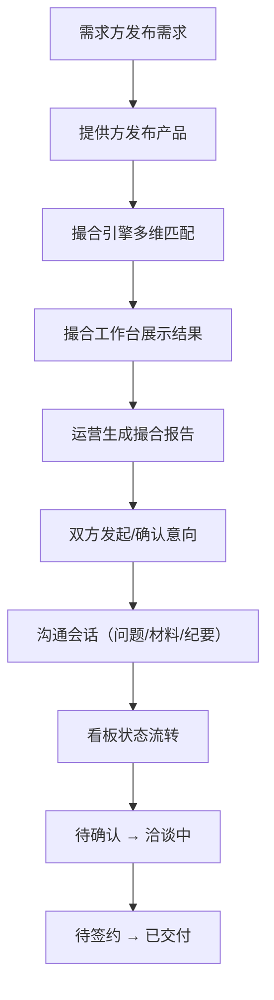

## 1. 产品概述

数据要素供需撮合平台，连接数据提供方、需求方与平台运营人员，实现数据资产的高效交易与合规流转。通过智能匹配、全流程沟通和可视化看板，降低供需对接成本，提升数据要素市场化配置效率。

- 服务三类用户角色：数据需求方、数据提供方、平台运营
- 覆盖需求发布 → 产品展示 → 智能撮合 → 全流程沟通 → 状态跟踪的完整闭环

## 2. 核心功能

### 2.1 用户角色

| 角色 | 注册方式 | 核心权限 |
|------|----------|----------|
| 需求方 | 企业注册 | 发布需求、浏览橱窗、发起意向、沟通洽谈、关闭需求、查看看板 |
| 提供方 | 企业资质认证 | 发布产品、管理橱窗、响应意向、上传材料、更新交付状态 |
| 平台运营 | 内部账号 | 撮合匹配、生成撮合报告、全流程监督、数据统计分析 |

### 2.2 功能模块

1. **需求发布页面**：需求表单（数据范围、使用目的、更新频率、预算）、需求列表、需求详情、收藏、关闭需求
2. **产品橱窗页面**：产品卡片列表、产品详情（说明、样例字段、可交付形式、限制条件）、筛选搜索、收藏、对比
3. **撮合工作台页面**：多维筛选器（行业、地域、时效、价格区间）、智能匹配结果、匹配度评分、撮合报告生成
4. **沟通记录页面**：意向发起、问题补充、材料上传、会议纪要、消息列表、时间线
5. **进展看板页面**：状态流转（待确认→洽谈中→待签约→已交付）、统计卡片、Kanban 视图、趋势图表

### 2.3 页面详情

| 页面名称 | 模块名称 | 功能描述 |
|----------|----------|----------|
| 需求发布 | 顶部导航栏 | 全局导航、角色切换、消息通知、用户中心 |
| 需求发布 | 需求表单 | 数据范围/使用目的/更新频率/预算输入、行业/地域选择、表单校验 |
| 需求发布 | 需求列表 | 卡片式展示、状态标签、筛选排序、收藏/关闭操作 |
| 需求发布 | 需求详情抽屉 | 完整信息展示、操作按钮、关联沟通入口 |
| 产品橱窗 | 产品卡片网格 | 图片、标题、标签、价格、评分、样例字段预览 |
| 产品橱窗 | 多维筛选栏 | 行业/地域/交付形式/价格区间筛选、搜索框 |
| 产品橱窗 | 对比功能 | 多产品侧 by 侧对比、差异高亮 |
| 产品橱窗 | 产品详情模态框 | 完整说明、字段样例、交付形式、限制条件、意向发起按钮 |
| 撮合工作台 | 匹配筛选器 | 行业、地域、时效、价格、数据规模筛选 |
| 撮合工作台 | 匹配结果列表 | 供需配对卡片、匹配度评分、匹配维度拆解 |
| 撮合工作台 | 撮合操作区 | 一键撮合、撮合报告预览与生成、导出 |
| 沟通记录 | 会话列表 | 供需配对会话、未读标识、最新消息预览 |
| 沟通记录 | 消息时间线 | 意向、问题、材料、纪要按时间排列 |
| 沟通记录 | 交互输入区 | 文本输入、文件上传、会议纪要模板 |
| 进展看板 | 统计概览卡 | 各状态数量、总数、转化率、金额统计 |
| 进展看板 | Kanban 面板 | 四列状态看板、卡片拖拽流转 |
| 进展看板 | 趋势图表 | 月度成交量、状态流转趋势折线/柱状图 |

## 3. 核心流程

需求方发布需求后，平台撮合引擎根据行业、地域、时效、价格等维度进行匹配。匹配结果在工作台展示，运营人员可生成撮合报告推送给双方。双方进入沟通会话，完成意向确认、问题澄清、材料上传、会议记录，最终在看板上完成状态流转直至交付。

## 4. 用户界面设计

### 4.1 设计风格

- **主色调**：深墨蓝 `#0E2A47`（专业、信任）、青绿 `#00D4AA`（科技、流通）
- **辅助色**：琥珀橙 `#FF8A3D`（预警、待处理）、冷灰 `#64748B`（中性文本）
- **按钮风格**：圆角 8px、渐变主按钮、悬停阴影与微动效
- **字体**：标题使用 "Charter BT"（衬线、庄重），正文使用 "Manrope"（无衬线、高可读性）
- **布局风格**：左侧导航栏 + 顶部标题栏 + 卡片式内容区，大量留白配合细边框
- **图标风格**：Lucide 线性图标，统一 20px 尺寸，线条 1.5px

### 4.2 页面设计概述

| 页面名称 | 模块名称 | UI 元素 |
|----------|----------|----------|
| 需求发布 | 表单区 | 分区标题、输入框带图标、下拉选择器、滑块预算、渐变提交按钮 |
| 产品橱窗 | 卡片网格 | 悬浮阴影、图片占位、角标标签、对比复选框、过渡动画 |
| 撮合工作台 | 匹配面板 | 左右双栏、匹配度环形进度、维度条形图、报告导出按钮 |
| 沟通记录 | 时间线 | 圆点节点、连接线、消息气泡、附件缩略图、纪要卡片 |
| 进展看板 | Kanban | 彩色状态标题、拖拽高亮、统计徽标、趋势图渐变填充 |

### 4.3 响应式

- Desktop-first 设计，基准宽度 1440px
- 1280px：侧栏收缩为图标导航
- 1024px：顶部导航转为汉堡菜单
- 768px：卡片网格降为单列，看板改为列表视图

### 4.4 动效与细节

- 页面加载：模块级渐入（opacity + translateY），stagger 延迟 60ms
- 卡片悬停：translateY(-4px) + 阴影加深，200ms cubic-bezier(0.4,0,0.2,1)
- 状态流转：卡片飞行动效 + 数字滚动动画
- 匹配度：环形进度 SVG 描边动画
