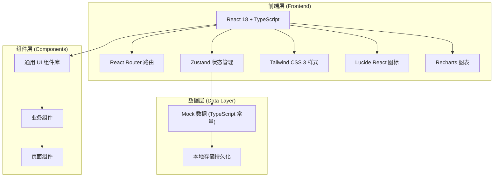
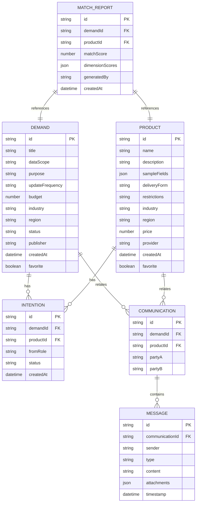

## 1. 架构设计



## 2. 技术描述

- **前端框架**：React 18 + TypeScript
- **初始化工具**：vite-init（react-ts 模板）
- **后端**：无后端，纯前端 Mock 数据演示
- **路由**：react-router-dom v6
- **状态管理**：zustand
- **样式方案**：tailwindcss 3
- **图标库**：lucide-react
- **图表库**：recharts
- **数据持久化**：localStorage

## 3. 路由定义

| 路由路径 | 页面组件 | 功能 |
|----------|----------|------|
| / | 重定向到 /dashboard | 默认入口 |
| /demands | DemandPublish | 需求发布与管理 |
| /showcase | Showcase | 产品橱窗浏览 |
| /matching | Matching | 撮合工作台 |
| /communication | Communication | 沟通记录中心 |
| /dashboard | Dashboard | 进展看板 |

## 4. 数据模型定义

### 4.1 核心数据结构



## 5. 目录结构

```
src/
├── components/          # 通用 UI 组件
│   ├── Layout.tsx       # 布局（侧栏+顶栏）
│   ├── Sidebar.tsx      # 侧边导航
│   ├── Header.tsx       # 顶部栏
│   ├── StatCard.tsx     # 统计卡片
│   ├── StatusBadge.tsx  # 状态标签
│   ├── EmptyState.tsx   # 空状态
│   └── Modal.tsx        # 通用模态框
├── pages/               # 页面组件
│   ├── DemandPublish.tsx
│   ├── Showcase.tsx
│   ├── Matching.tsx
│   ├── Communication.tsx
│   └── Dashboard.tsx
├── store/               # Zustand 状态
│   ├── useDemandStore.ts
│   ├── useProductStore.ts
│   ├── useCommunicationStore.ts
│   └── useUiStore.ts
├── data/                # Mock 数据
│   ├── demands.ts
│   ├── products.ts
│   ├── communications.ts
│   └── matchReports.ts
├── types/               # 类型定义
│   └── index.ts
├── utils/               # 工具函数
│   ├── matchEngine.ts   # 匹配算法
│   ├── formatters.ts    # 格式化
│   └── constants.ts     # 常量配置
├── App.tsx
├── main.tsx
└── index.css
```

## 6. 关键设计决策

1. **纯前端 Mock**：用户未要求后端，所有数据以 TS 常量 + localStorage 形式存在
2. **匹配算法**：在 `utils/matchEngine.ts` 中实现多维加权匹配（行业 30%、地域 20%、时效 25%、价格 25%）
3. **状态隔离**：Zustand 按业务域拆分 store，避免单一 store 过大
4. **图表选型**：Recharts 轻量且与 React 集成良好，满足看板趋势图需求
5. **拖拽交互**：看板 Kanban 使用原生 HTML5 Drag & Drop，避免引入额外库
